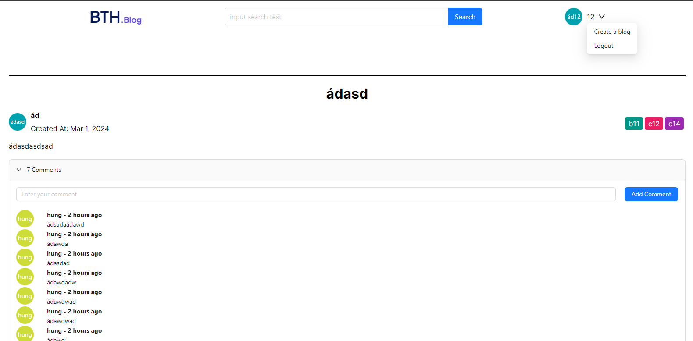
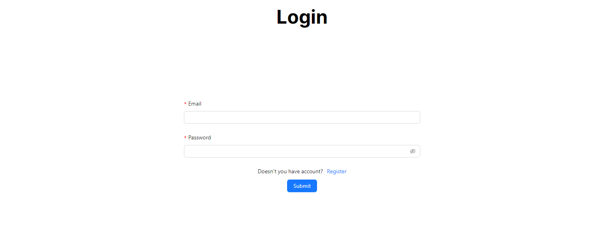
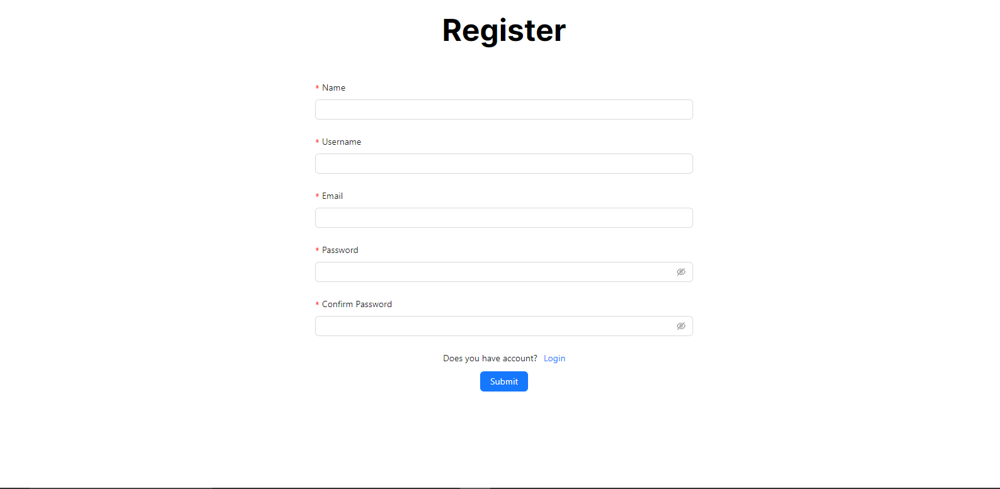
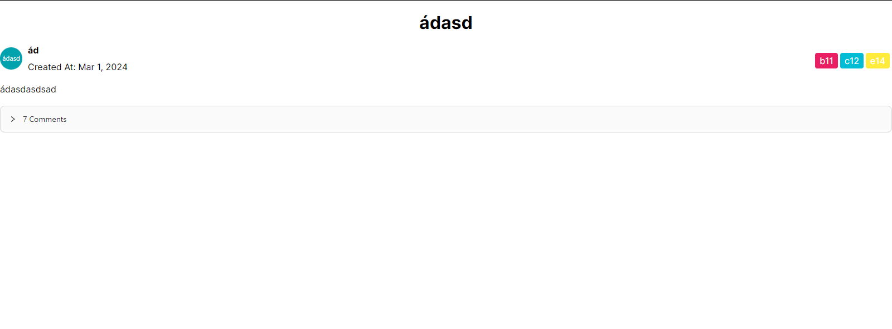

## Usage

To run this project locally, follow these steps:

1. **Frontend:**

   - DO Homepage according to requirement (/)
     
   - DO Login/Register page /login, /register
     
     
   - DO Detail blog page (/[id])
     
   - DO calling API from server

   - Navigate to the `/frontend` directory.

     ```
     cd frontend
     ```

   - Install dependencies using Yarn.

     ```
     yarn install
     ```

   - Start the development server.

     ```
     yarn dev
     ```

   - Access the application in your browser at `http://localhost:3000`.

2. **Backend:**

   - DO ALL API (CRUD) /blogs, /comments, /users
   - DO authentication /auths
   - DO validate for request data

   - Navigate to the `/backend` directory.

     ```
     cd backend
     ```

   - Install dependencies using npm.

     ```
     npm install
     ```

   - Start the server.

     ```
     npm start
     ```

   - The backend server will be running on `http://localhost:8080`.
